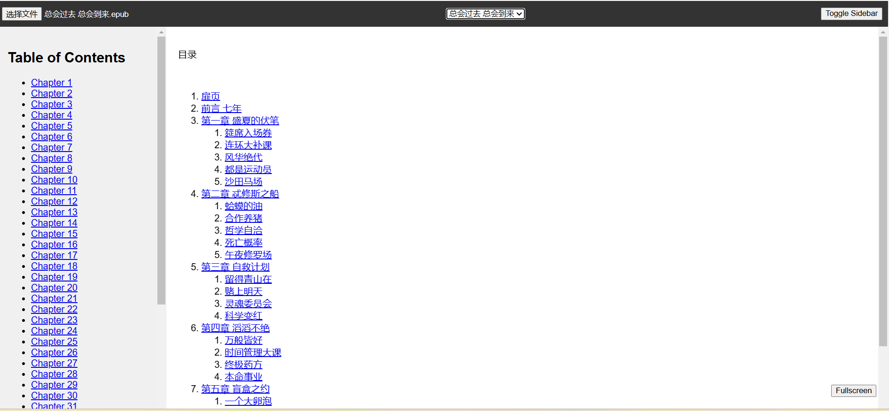

# EPUB Server Reciter

这是一个交互式和高效的EPUB阅读应用程序，用户可以直接在浏览器中上传和阅读EPUB文件。该项目由用于处理文件上传和解析的后端代码以及带有用户友好界面的前端页面组成，提供便捷的EPUB书籍阅读和内容导航功能。


## 特别说明

本代码90%来自AI（Claude3.5）的协助生成，另有文档说明整个过程：[AI助我写代码（7）：电子书朗读服务器版（Epub Server Reciter）](https://www.broyustudio.com/2024/09/04/AI-Help-Epub-Local-Reciter.html)

## 功能特点

- **上传EPUB文件**: 用户可以通过应用程序直接上传自己的EPUB书籍。
- **目录导航**: 应用程序会动态加载并显示上传的EPUB文件的目录，用户可以跳转到不同的章节。
- **进度跟踪**: 使用本地存储跟踪用户的阅读进度，允许用户从上次停止的地方继续阅读。
- **键盘快捷键**: 使用箭头键或空格键浏览章节，增强阅读体验。
- **全屏模式**: 可以轻松切换到全屏模式，以便专注阅读。
- **响应式设计**: 应用程序可调整到不同屏幕大小，以便在桌面和平板设备上进行最佳阅读。

## 优势

- **无需外部依赖**: 该应用程序不依赖外部的EPUB服务或阅读器，使其完全自包含。
- **可定制和扩展**: 代码简单明了，易于自定义或扩展功能。
- **无缝的章节导航**: 键盘和可点击的导航使浏览章节变得简单。
- **本地进度存储**: 用户的阅读进度保存在本地，允许用户从上次停止的地方继续阅读。

## 适用场景

- 个人电子书库，用户可以存储、上传和阅读自己的EPUB文件。
- 提供用户阅读和互动数字书籍的教育平台。
- 适用于学校或组织的阅读应用程序，提供本地和可定制的电子书阅读器。

## 安装指南

### 前提条件

- Python（用于运行简单服务器）
- HTML/CSS/JavaScript基础知识（用于定制）
- EPUB文件用于测试应用程序

### 后端安装

1. 克隆此存储库：
   ```bash
   git clone https://github.com/winglight/epub-server-reciter.git
   cd epub-server-reciter
   ```

2. 安装依赖：
   ```bash
   pip install -r requirements.txt
   ```

3. 启动服务器：
   ```bash
   python main.p
   ```

服务器默认在 `http://localhost:5000` 启动。

### 前端使用

1. 打开浏览器并导航到 `[localhost:3000](http://localhost:5000)`。
2. 使用文件输入上传EPUB文件，在下拉框中选择epub文件。
3. 应用程序将解析并加载书籍的目录。
4. 使用侧边栏或键盘（左右箭头、空格键）在章节之间导航。
5. 使用全屏按钮切换全屏模式，以实现无干扰阅读。

## 技术要求

- **Node.js** 用于后端操作。
- **HTML/CSS/JavaScript** 用于前端定制。
- **现代浏览器** （Chrome、Firefox、Safari或Edge）访问阅读器。

## 贡献

欢迎通过issues和pull requests为本项目做出贡献。

## 许可证

此项目在MIT许可证下开源。详情请参见 [LICENSE](LICENSE) 文件。
